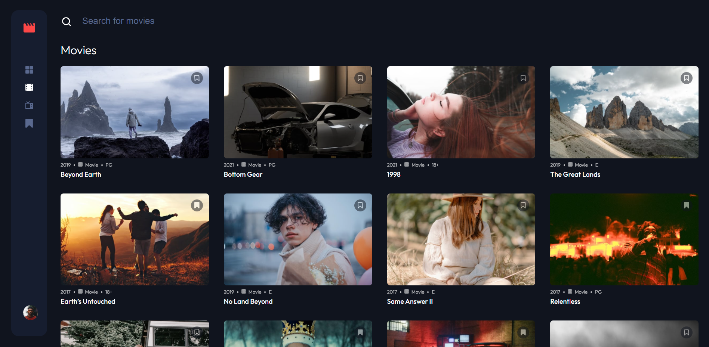
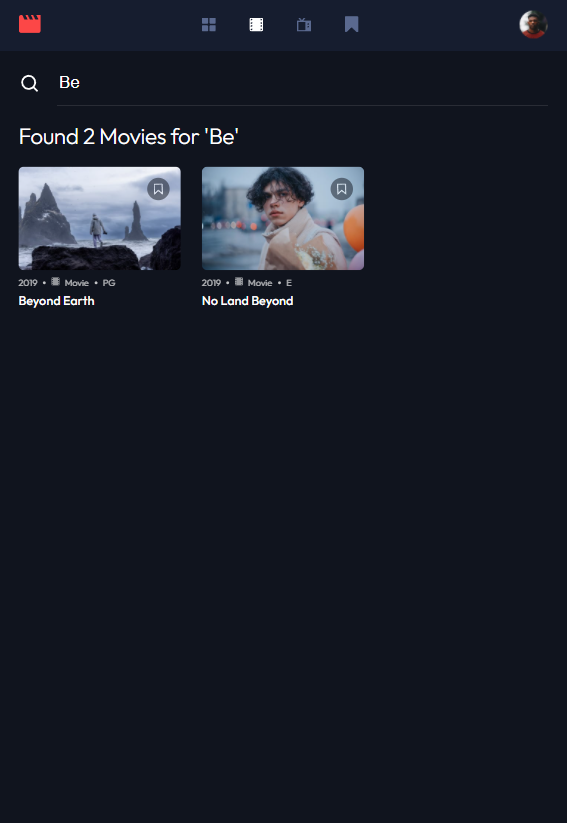

# Frontend Mentor - Entertainment web app solution

This is a solution to the [Entertainment web app challenge on Frontend Mentor](https://www.frontendmentor.io/challenges/entertainment-web-app-J-UhgAW1X). Frontend Mentor challenges help you improve your coding skills by building realistic project.

## Table of contents

- [Overview](#overview)
  - [The challenge](#the-challenge)
  - [Screenshot](#screenshot)
  - [Links](#links)
- [My process](#my-process)
  - [Built with](#built-with)
  - [What I learned](#what-i-learned)


## Overview

I picked this challenge after a spat of professional boredom and I wanted to knock something out real quick as cleanly as I could. The challenge itself is pretty straightforward but I had two main struggles/learning curves: building a horizontal slider (I've never had to before) and trying to handle all data and events in a reactive fashion instead of an imperative one.

### The challenge

Users should be able to:

- View the optimal layout for the app depending on their device's screen size
- See hover states for all interactive elements on the page
- Navigate between Home, Movies, TV Series, and Bookmarked Shows pages
- Add/Remove bookmarks from all movies and TV series
- Search for relevant shows on all pages

### Screenshot





### Links

- Solution URL: [GitHub](https://github.com/JDillon522/frontendMentor-entertainment-app)
- Live Site URL: [GitHub Pages](https://jdillon522.github.io/frontendMentor-entertainment-app/)

## My process

For large projects like these I always build a "Kitchen Sink" page with all the design elements on a single page. I try to organize my styles from an Atomic Design perspective (ie: atoms -> elements -> molecules -> pages), but it doesnt always translate well into my projects.

I organize my code into a couple of main "buckets":

- `/pages`: contains anything that is routable. These are lazy loaded modules.
- `/shared`: contains any reusable components found on (potentially) multiple pages.
- `/styles`: contains any global styles, mixes, variables, etc.

My first challenge was the horizontal scroll for the Trending section. I've never had to build one so it was a neat challenge to figure it out. I have a `media-container` component that renders one or more `media-card` components. I reused this component for the static grid and for the horizontal scrolling.

Implementing a simple scroll on the X coordinates was a simple bit of CSS, but programmatically scrolling the next set of cards into view was wholly different.

Heres the relevent code from [`media-container.component.ts`](./src/app/shared/components/media-container/media-container.component.ts):

```javascript
@ViewChildren('mediaCard', { read: ElementRef })
private mediaCards!: QueryList<ElementRef>;

...

public scrollContainer(scrollToDirection: 'left'|'right') {
    const docWidth = document.documentElement.clientWidth;
    let toLeft = 0;
    let toRight = 0;
    let onScreen = 0;

    this.mediaCards.forEach(card => {
      const cardRect = card.nativeElement.getBoundingClientRect();
      // count how many are off screen to the left
      if (cardRect.left < 0) {
        toLeft++;

      // count how many are on the screen
      } else if (cardRect.right < docWidth) {
        onScreen++;

      // count number of cards to the right
      } else if (cardRect.right > docWidth) {
        toRight++;
      }
    });

    // Get either the next set that'll fit on the screen or the last|first one
    let scrollToIndex = 0;
    const len = this.mediaCards.length;

    if (scrollToDirection === 'right') {
      // Subtract 1 in (onScreen * 2 - 1) so we dont overflow the one slightly overflowing
      scrollToIndex = toRight - onScreen > 0 ? toLeft + (onScreen * 2 - 1) : len - 1;

    } else {
      scrollToIndex = toLeft - onScreen > 0 ? toLeft - onScreen : 0;
    }

    // Scroll into view
    this.mediaCards.get(scrollToIndex)?.nativeElement.scrollIntoView({ behavior: 'smooth', block: 'center' });
}
```

Once the "Kitchen Sink" was built out it was a relatively trivial process to integrate all the other pages.

### Built with

- [Angular](https://angular.io) - The only framework worth building large apps with.

### What I learned

Reactive programing is/can be very clean. However, Rxjs is not an intuitive library. My goal was not to have any subscriptions in the entire app and to simply pipe events and let `async` pipes do the rendering. This proved more difficult than I thought.

The `search-field` component acts as a simple filter for whatever stream of data is on the page. My intent was that the search field would have a simple interface for filtering a stream of media data without a ton of repeated boilerplate code - and without any subscriptions.

I found a solution using only a single subscription in the `search-field` itself. I had to subscribe to the `valueChanges` property on the `formControl` in order to pick up those changes and then emit a value change.

Relevant code:

```html
<!-- home.component.html -->
<app-search-field [searchSubject]="searchString"></app-search-field>
```

```javascript
// home.component.ts
public searchString = new BehaviorSubject<string>('');

ngOnInit(): void {
  ...
  this.all = this.dataService.all$;
  this.filteredAll = this.dataService.filterMediaStream(this.searchString, this.all);
}

// search-field.component.ts
public search: FormControl = new FormControl();
private searchSub!: Subscription;

@Input()
public searchSubject!: Subject<string>;

ngOnInit(): void {
  this.searchSub = this.search.valueChanges.pipe(
    debounceTime(250)
  ).subscribe(change => {
    this.searchSubject?.next(change)
  });
}

ngOnDestroy(): void {
  this.searchSub.unsubscribe();
}

// data.service.ts
public filterMediaStream = (searchString: Observable<string>, mediaStream: Observable<IMedia[]>) => {
  return combineLatest([searchString, mediaStream])
    .pipe(
      distinctUntilChanged(),
      map(([search, allMedia]: [string, IMedia[]]) => {
        if (!search) {
          return allMedia;
        }

        return allMedia.filter(media => {
          return new RegExp(search.toLocaleLowerCase()).test(media.title.toLocaleLowerCase())
        });
      })
    );
}
```

### Update On Reactive Programing
I posted a [request for feedback on Reddit](https://www.reddit.com/r/Angular2/comments/tr6vqj/pure_reactive_programming_attempt_feedback_request/) (gasp! I know, I'm brave). I received a lot of great feedback, especially from [@dmitryef](https://www.reddit.com/r/Angular2/comments/tr6vqj/comment/i2nf4rd/?utm_source=share&utm_medium=web2x&context=3) who took the time to update things to be purely reactive. The changes were pretty drastic but mostly related to how I was instantiating variables, tracking changes, and updating.
